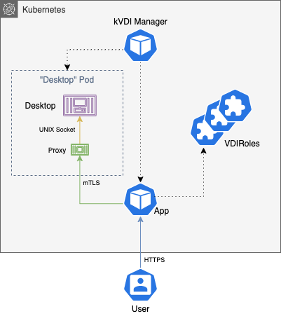

# kVDI

A Kubernetes-native Virtual Desktop Infrastructure.

**This is a very heavy work-in-progress and not even remotely close to ready for production usage**

 - [CRD Reference](doc/crds.md)
 - [Security](#security)
 - [Screenshots](#screenshots)

## Requirments

Cluster requirements

  - `cert-manager >= 0.14.1`
    - The manager uses the `v1alpha3` API for certificate provisioning
  - `snd-aloop` host-kernel support (optional, for sound emulation)

For building and running locally you will need:

  - `go >= 1.13`
  - `docker`

## Building and Running Locally

The `Makefiles` contain helpers for testing the full solution locally using `kind`.

```bash
# Builds all the docker images (optional, they are also available in the quay repo)
$> make build-all
# Spin up a kind cluster and load cert-manager and metallb into it
$> make full-test-cluster
# Load all the docker images into the kind cluster (optional for same reason as build)
$> make load-all
# Deploy the manager and setup the example VDI manifests
$> make deploy example-vdi
```

After the manager has finished spinning up the `app` instance, get the IP of its service with `kubectl get svc` to access the app interface.

If not using anonymous auth, look for `example-vdicluster-admin-secret` to retrieve the `admin` password.

## Security

All traffic between processes is encrypted with mTLS.
The UI for the "desktop" containers is placed behind a VNC server listening on a UNIX socket and a sidecar to the container will proxy validated websocket connections to it.



A finished implementation would include user authentication and role-based access control enforced from the `app` instance and API.

## Screenshots

The UI is super basic but here are some shots of what I have so far


